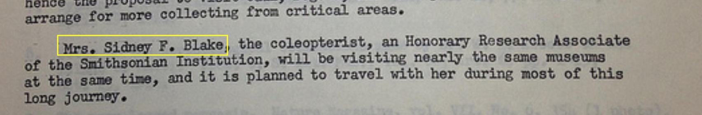

## Motivation

* [social network of dead people](https://www.ultrasaurus.com/2014/09/linking-people-through-history/)

## Use Cases

### Archival collection

Can we connect digital records such that the provenance of knowledge can be traced in order to streamline the research process? For a use case, we can look at a focused research questions that was answered in digital archives with multiple searches and expert research analysis (via [Smithsonian Collections Blog](https://si-siris.blogspot.com/2013/09/field-notebook-mystery-triggers.html))

Doris Cochran was a herpetologist who collected over 3,000 frog specimens from Brazil in her career.  Her [1962-1963 travelogue](https://transcription.si.edu/project/6618) documents Doris Cochran's National Science Foundation funded trip to visit museums in South America and collect frog specimens.  In 2013, Smithsonian Institution created an online
[Transcription Center](https://transcription.si.edu/) where volunteers could
transcribe historic documents. One volunteer questioned whether the catalog 
meta-data was correct. The writer of the travelog mentioned a travel companion
"Doris" --  was this book written by another scientist?

Working with archivists and researchers at the Smithsonian Institution Archives,
we discovered the original [NSF research proposal](https://1.bp.blogspot.com/-LG1F7Gg9Btk/UhvYGF0YHtI/AAAAAAAAB8Y/lHUo4BzweYM/s1600/Original+NSF+Grant+for+1962+South+America+Trip.jpg)
which mentions Mrs. Sydney Blake.

1. Archivist Annie -- takes papers from Doris Cohran's office, catalogs them for the physical archives and creates digital records ([Finding Aid](https://siarchives.si.edu/collections/siris_arc_217308))

2. Digitizer Don -- creates digital image from the field notebook, giving it an independent digital record ([ID: SIA RU007151](https://siarchives.si.edu/collections/fbr_item_modsi3804)) with reference to the collection of papers.

2. Researcher Ric -- documents NSF grant proposal with reference to Mrs. Sydney Blake 

3. Researcher Ellen -- determines that Mrs. Sydney Blake is the "Doris" mentioned in the field notebook.

## Relevant Technology

### Verifiable Credentials
  * [use cases](https://w3c.github.io/vc-use-cases/)
  * [data model](https://www.w3.org/TR/vc-data-model/)

